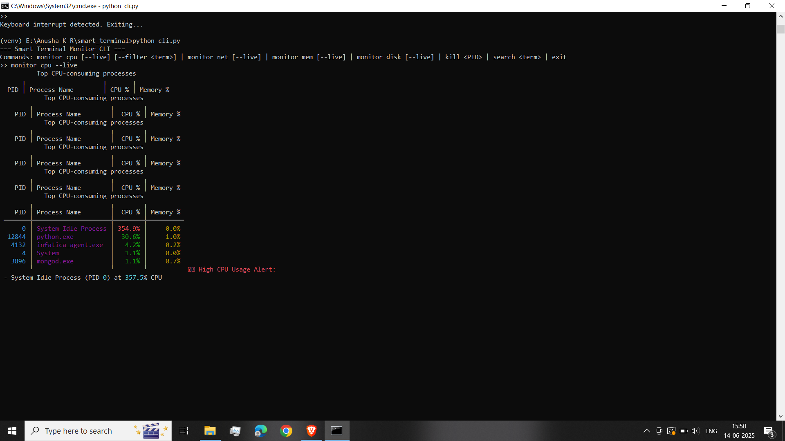
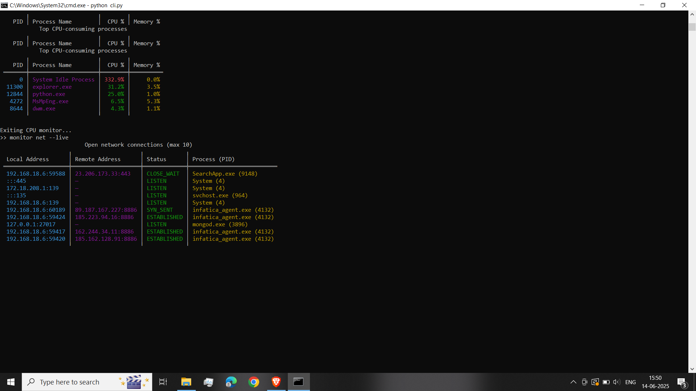
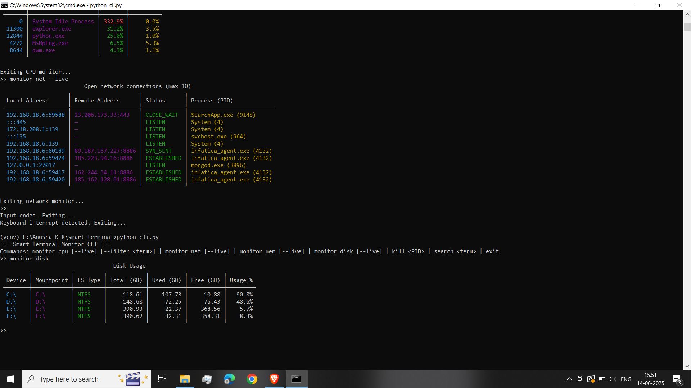

# 🖥️ Cool Terminal

A smart terminal-based system monitoring tool that provides real-time insights into your system's performance.

## 🚀 Features

* 📊 CPU, memory, disk, and process monitoring
* 🌐 Network activity tracking
* ⚠️ Custom alerts configuration
* 🎨 Rich CLI interface with color-coded output

## 🛠️ Tech Stack

* Python 3.x
* [rich](https://github.com/Textualize/rich)
* [psutil](https://github.com/giampaolo/psutil)
* [scapy](https://github.com/secdev/scapy)

## 📸 Screenshots

Here’s what Cool Terminal looks like in action:






## 📦 Installation

```bash
# Clone the repo
git clone https://github.com/anusha-kr01/cool_terminal.git
cd cool_terminal

# (Optional) Create a virtual environment
python -m venv venv
venv\Scripts\activate  # Windows

# Install dependencies
pip install -r requirements.txt
```

## ▶️ Usage

To start the main dashboard:

```bash
python main.py
```

To explore CLI commands directly:

```bash
python cli.py
```

Once in the CLI, you can try the following:

### 🔍 Monitoring Commands

| Command                       | Description                              |
| ----------------------------- | ---------------------------------------- |
| `monitor cpu`                 | View top CPU-consuming processes         |
| `monitor cpu --live`          | Live view of CPU usage                   |
| `monitor cpu --filter <term>` | Filter CPU monitor by name or PID        |
| `monitor mem`                 | View top memory-consuming processes      |
| `monitor mem --live`          | Live view of memory usage                |
| `monitor disk`                | Check disk usage across devices          |
| `monitor disk --live`         | Live disk monitoring                     |
| `monitor net`                 | View current network connections         |
| `monitor net --live`          | Live network connection updates          |
| `monitor summary`             | View overall system summary              |
| `monitor all --live`          | Live view of CPU, memory, disk & network |

### ⚙️ Logging Commands

| Command       | Description                     |
| ------------- | ------------------------------- |
| `log cpu`     | Save a snapshot of CPU usage    |
| `log mem`     | Save a snapshot of memory usage |
| `log disk`    | Save a snapshot of disk usage   |
| `log net`     | Save a snapshot of network data |
| `log summary` | Save a full system summary      |

### 🔧 Utility Commands

| Command         | Description                             |
| --------------- | --------------------------------------- |
| `search <term>` | Search for a process by name or PID     |
| `kill <PID>`    | Terminate a specific process by its PID |
| `exit`          | Exit the CLI                            |

## 📁 Project Structure

```bash
cool_terminal/
│
├── core/            # Core system monitors
├── ui/              # CLI UI components
├── config/          # Alert configuration
├── main.py          # Entry point
├── cli.py           # CLI command handler
├── requirements.txt # Python dependencies
└── README.md        # Project info
```

## 📝 License

This project is licensed under the MIT License.

---
